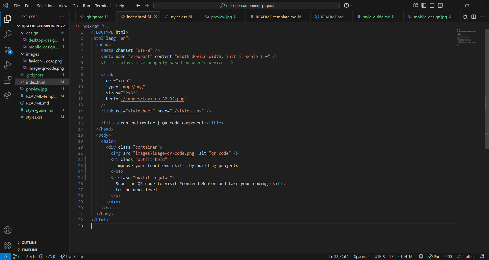
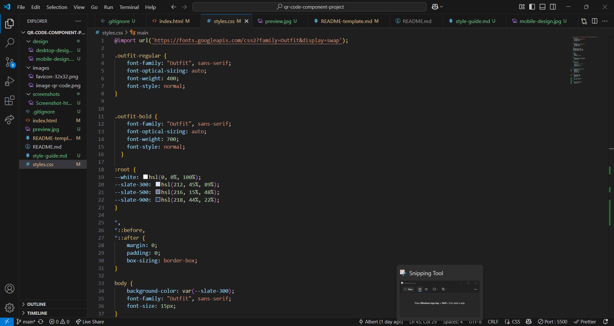
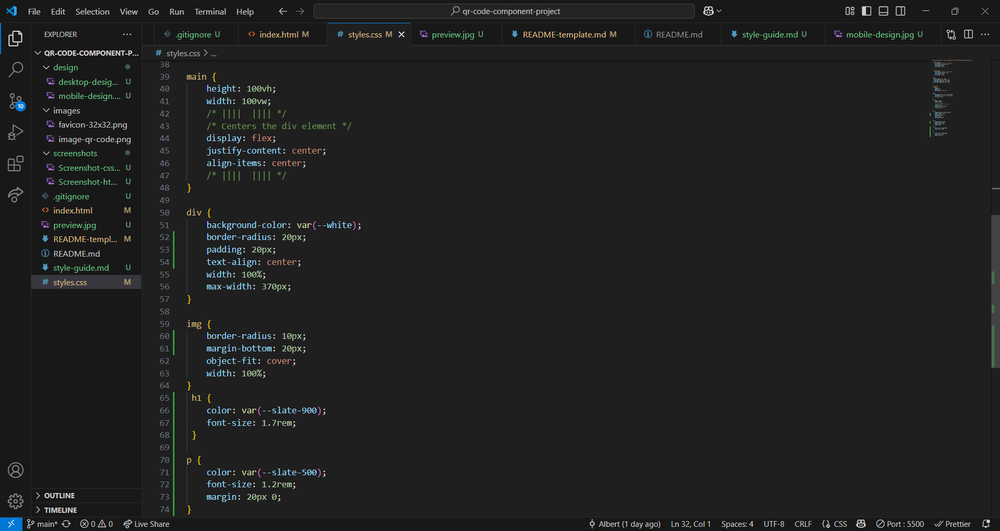

# Frontend Mentor - QR code component solution

This is a solution to the [QR code component challenge on Frontend Mentor](https://www.frontendmentor.io/challenges/qr-code-component-iux_sIO_H). Frontend Mentor challenges help you improve your coding skills by building realistic projects.

## Table of contents

- [Overview](#overview)
  - [Screenshot](#screenshot)
  - [Links](#links)
- [My process](#my-process)
  - [Built with](#built-with)
  - [What I learned](#what-i-learned)
  - [Continued development](#continued-development)
  - [Useful resources](#useful-resources)
- [Author](#author)
- [Acknowledgments](#acknowledgments)

**Note: Delete this note and update the table of contents based on what sections you keep.**

## Overview

To create the QR Component project to the specifications of the provided design.

### Screenshot





### Links

- Solution URL: [Add solution URL here](https://your-solution-url.com)
- Live Site URL: [Add live site URL here](https://your-live-site-url.com)

## My process

- HTML, I was advised to always wrap my content with the main element to start. Next a div element was placed for the container. Inside the container the img, h1, and p elements were placed in that order.
- CSS, Following the style guide provided I imported the font, set up colors in root, and reset the default HTML styling. For the body element the font-family and font-size were applied according to the style guide.
  Styled the div and the elements nested within it starting at the top and working my way down.
- Final, Played around with the values of some CSS properties to get a match to the design of the .jpg files in the "design" folder.

### Built with

- Semantic HTML5 markup
- CSS custom properties
- Flexbox
- Mobile-first workflow

### What I learned

How to center the div element on the screen vertically. I could not get the "margin: auto;" to work. I resorted to using flex.

```html
<body>
  <main>
    <div class="container">
      
      <h1 class="outfit-bold">
        Improve your front-end skills by building projects
      </h1>
      <p class="outfit-regular">
        Scan the QR code to visit Frontend Mentor and take your coding skills to
        the next level
      </p>
    </div>
  </main>
</body>
```

```css
main {
  height: 100vh;
  width: 100vw;
  /* ||||  |||| */
  /* Centers the div element */
  display: flex;
  justify-content: center;
  align-items: center;
  /* ||||  |||| */
}
```

### Continued development

To continue improving my HTML and CSS skills.

### Useful resources

- [W3Schools](https://www.w3schools.com/css/css_align.asp) - This helped me to place the div element in the center of the screen.

## Author

- Website - [Add your name here](https://www.your-site.com)
- Frontend Mentor - [@BerSki90](https://www.frontendmentor.io/profile/BertSki90)
- Twitter - [@BertSki90](https://www.twitter.com/BertSki90)

**Note: Delete this note and add/remove/edit lines above based on what links you'd like to share.**

## Acknowledgments

I have done most of my learning at FreeCodeCamp.org. It is a great community. I am excited to start Frontend Mentor projects.
